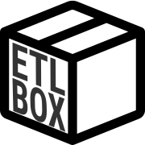

## Introduction to ETLBox

 is a powerful and open-source ETL (Extract, Transform, Load) library that simplifies data integration and transformation tasks. Unlike traditional ORM frameworks like Entity Framework, ETLBox is engineered to handle bulk data operations efficiently. In EFBox, ETLBox plays a crucial role as the underlying framework, extending EFBox's capabilities in managing bulk data operations. It allows ETLBox to perform bulk insert, update, delete, and merge operations more proficiently. With ETLBox, EFBox users can easily transition from regular ORM operations to more advanced ETL processes, gaining better performance and control over their data workflows.





### Advantages of Transitioning to ETLBox

ETL, standing for Extract, Transform, Load, is a crucial process in data handling, enabling the migration of data from source systems into a data warehouse. , as the name suggests, is a comprehensive library that enhances this core process, with a special emphasis on the transformation phase. It encourages a Test-Driven Development (TDD) approach, which is fundamental for ensuring the reliability and accuracy of data flows. Transitioning to ETLBox from Entity Framework brings forth numerous advantages including remarkable performance improvements, parallel execution, advanced error logging, and the enablement of highly customizable ETL jobs tailored for big data scenarios. Its code-only framework eradicates UI barriers, paving the way for streamlined, efficient data processing and integration tasks.

## ORM vs ETL

Traditional ORM (Object-Relational Mapping) approaches such as Entity Framework primarily facilitate data interaction within an application, translating between the object and relational models. On the other hand, ETLBox's methodology is rooted in the ETL paradigm which is aimed at data integration and transformation, offering a more specialized toolset for managing data workflows.   provides an avenue for handling large-scale data processes efficiently, boasting features like parallel execution and advanced error logging which are pivotal in ETL operations. Transitioning to ETLBox can empower developers to harness a more robust and performance-oriented data management approach, especially in scenarios demanding high-volume data processing and transformation.

Consider a retail company with numerous stores nationwide. Daily, each store generates vast amounts of sales, inventory, and customer data. Using traditional ORM approaches like Entity Framework, consolidating and analyzing this data centrally can be slow and inefficient. With ETLBox, the company can create optimized ETL processes to extract data from various sources, transform it into a unified format, and load it into a centralized data warehouse swiftly. ETLBox's parallel execution ensure quick data processing, enabling timely insights for decision-makers, which is crucial for inventory management, sales forecasting, and customer engagement strategies.

## Conclusion

Transitioning to  from traditional ORM frameworks like Entity Framework unveils a realm of possibilities in data management. With its specialized ETL capabilities, performance optimization, and streamlined error logging, ETLBox not only accelerates data processing but also ensures accuracy and reliability. It's a significant leap towards handling big data scenarios efficiently, providing a robust foundation for advanced data integration tasks. Adopting ETLBox is a strategic move for organizations looking to enhance their data workflows, ensuring they are well-equipped to derive actionable insights from their data, driving informed decision-making and ultimately, achieving business goals.